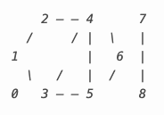

# Introduction
Throughout the course, we have seen several algorithms and structures for organizing and manipulating data, and with the current circumstance where gas prices in the U.S. hit a fresh new high, we decide to build a project which is able to draw the shortest path between a starting point and a destination on road network of North America

# Data Parsing
# BFS Algorithm
In our final program, we implement Breadth-first search (BFS) algorithm for finding the shortest path between two given points. Data structure queue is used as an extra memory in this algorithm so that the space complexity is $O(N)$. We test this algorithm on a small dataset as draw below and we make sure that our BFS visit correct nodes in correct order. Edge cases like cyclic route and disconnected route are also tested.
 
 

However, this algorithm cannot solve our leading question, as BFS take the distance between each node as equal while in practice road length varies.

# Dijkstra's Algorithm
To make up the deficiency of BFS algorithm on finding the shortest path and answer our leading question, we implement Dijkstra's algorithm. Instead of queue, we choose to use priority queue this time in order to spare the time visiting  numerous unrelated nodes. we test this algorithm on the same dataset as was used in BFS algorithm testing. 

# Graph Visualization

# Summary

